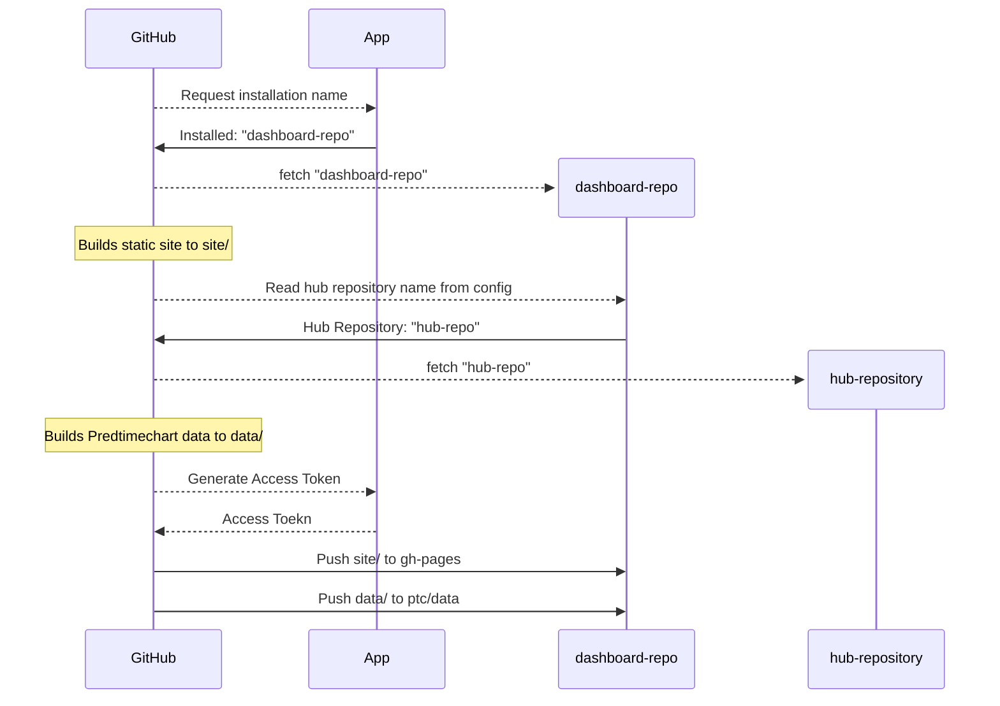
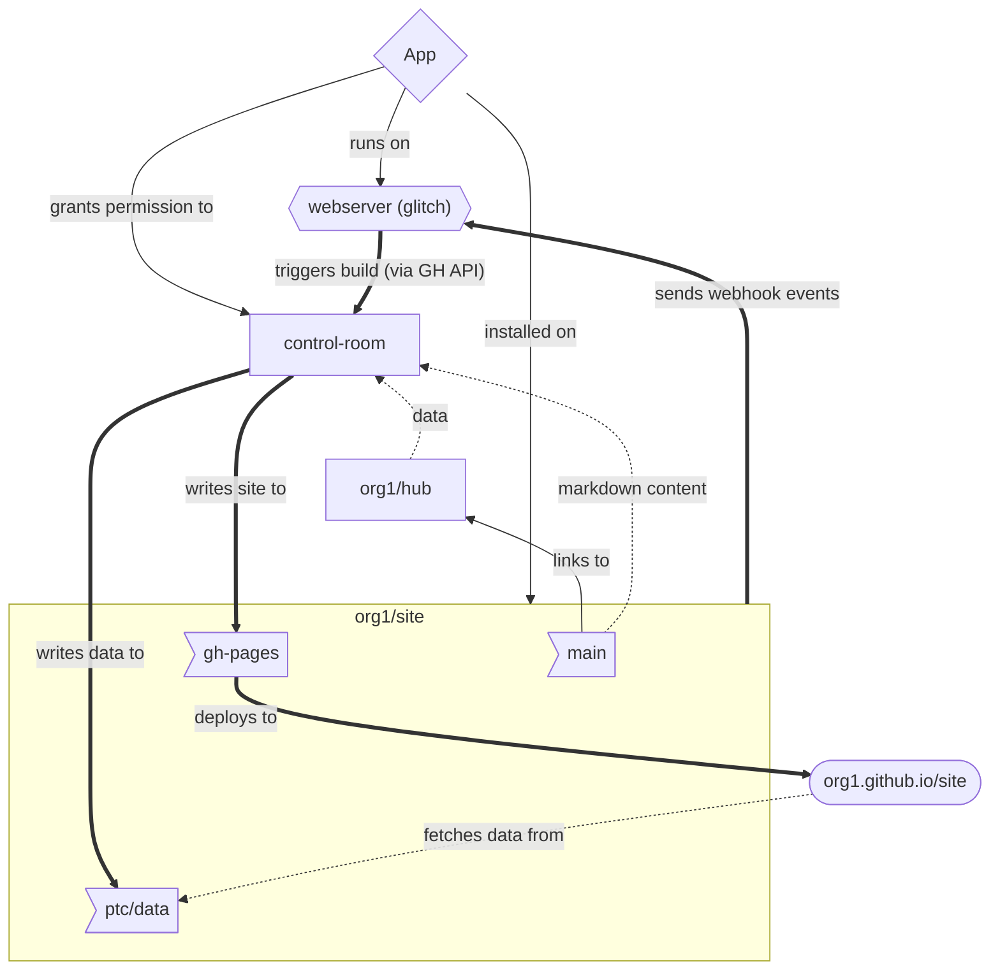

# hub-dashboard-control-room

> [!NOTE]
>
> This project is a proof of concept.

This repository contains operational workflows for the [hubDashboard App](https://github.com/apps/hubDashboard).
The workflow will generate predtimechart data and build a static site for each
repository that installed the app.

## Broad Architecture

The hubDashboard App allows hub administrators to opt-in to an auto-generated
dashboard. By default, when anyone installs the app on their dashboard
repository, the dashboard will be built once on the initial build and then
every day on a schedule defined in this repository. The role of the app in this
workflow is twofold:

1. provide a list of repositories that have it installed.
2. provide credentials for our workflows to write to branches of the dashboard

The workflow looks like this for each repository 
(note the build processes are in parallel):



### Tools

There are two tools that are used in this workflow. The processes are described
below

 - [hub-dash-site-builder (Docker container to build the site with quarto)](https://github.com/hubverse-org/hub-dash-site-builder)
 - [hub-dashboard-predtimechart (Python app to build predtimechart data for the forecasts)](https://github.com/hubverse-org/hub-dashboard-predtimechart)

### On-Demand Builds

One of the advantages of using an app is that it can provide on-demand builds
without requiring maintainers running or knowing how to run GitHub workflows.

It's useful to understand that a GitHub App is kind of like a mailbox. It can
receive messages (webhooks) and send messages (API requests). Just like a
mailbox, you cannot just stick one in a random place an assume that you can
start receiving messages---you have to give it an address (a webserver).

In our case, we have [hubDashboard (GitHub app)](https://github.com/apps/hubDashboard) which is running on [glitch (webserver)](https://glitch.com/~crystal-glimmer-path). The scripts for this app live in [`app/index.js`](app/index.html).

When the app is installed on a repository, GitHub knows that it has to send
[webhook events related to installations, issue comments, and pushes](https://docs.github.com/en/webhooks/webhook-events-and-payloads) to the
webserver address (which at the moment is
https://crystal-glimmer-path.glitch.me/probot). When the app receives webhooks
that it recognises, then it will send a GitHub API request with a [repository
dispatch event](https://docs.github.com/en/actions/writing-workflows/choosing-when-your-workflow-runs/events-that-trigger-workflows#repository_dispatch)
which will trigger a build.

All the pieces together look like this:



## General workflow steps

In the two sections below, I detail the general implementations.

### Predtimechart data

The general steps to generate the data for predtimechart are:

1. install 
   [hub-dashboard-predtimechart](https://github.com/hubverse-org/hub-dashboard-predtimechart)
   via
   ```bash
   pip install --upgrade pip
   pip install git+https://github.com/hubverse-org/hub-dashboard-predtimechart
   ```
2. clone the dashboard repository and enter it (you only need the `predtimechart-config.yml`)
3. clone the hub repository into `repo/`
4. Generate the Predtimechart data
   ```bash
   mkdir -p out/targets/
   mkdir -p out/forecasts/
   ptc_generate_target_json_files \
     repo \
     predtimechart-config.yml \
     out/targets
   ptc_generate_json_files \
     repo \
     predtimechart-config.yml \
     out/predtimechart-options.json \
     out/forecasts
   ```
5. enter `repo/` and checkout the `ptc/data` branch
6. copy the contents of `../data` to your current folder
7. add, commit, and push


### Static Site

The static site is generated via the [hubverse-org/hub-dash-site-builder
container](https://github.com/hubverse-org/hub-dash-site-builder/pkgs/container/hub-dash-site-builder)
and writes a folder called `_site/` under the `pages/` folder of the dashboard
repository. You need to then copy the contents of `_site/` into the `gh-pages`
branch of the dashboard repository. 


1. clone the dashboard repository
2. Run the container:
   ```bash
   $ docker run \
     --platform=linux/amd64 \
     --rm \
     -ti \
     -v "/path/to/dashboard/repo":"/site" \
     ghcr.io/hubverse-org/hub-dash-site-builder:main \
     bash render.sh 
   ```
3. clone the gh-pages branch of the dashboard repository into `pages/`
4. copy the files from the `dashboard repo/site/pages/_site/` folder into `pages/`
5. push the `pages/` folder up. 

