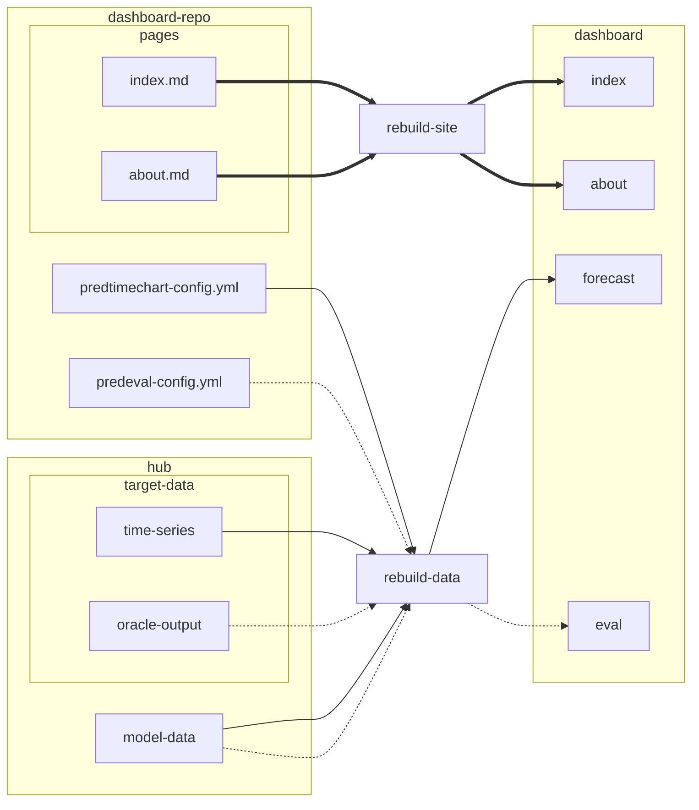

# hub-dashboard-control-room

> [!NOTE]
>
> This project is a proof of concept.

## Overview

This repository contains scripts and re-usable workflows that can be used to
build a hub dashboard that can be maintained separate from a hub.

## Usage

There are two ways to use these workflows:

1. via re-usable workflows (if you can run workflows in your repository)
2. app-based runs (if you are unable to run workflows in your repository)

For both options, you will make a copy of [the hub dashboard
template](https://github.com/new?template_name=hub-dashboard-template&template_owner=hubverse-org).

If you want to register [the hubDashboard
app](https://github.com/apps/hubdashboard/installations/new), you can install
it on the specific repository and then make a pull request to this repository
that modifies `known-repos.json` that includes your repository.

### Re-usable workflows

## Implementation Details



### Tools

There are three tools that are used in this workflow. The processes are described
below

 - [hub-dash-site-builder (Docker container to build the site with quarto)](https://github.com/hubverse-org/hub-dash-site-builder)
 - [hub-dashboard-predtimechart (Python app to build predtimechart data for the forecasts)](https://github.com/hubverse-org/hub-dashboard-predtimechart)
 - [hubPredEvalsData-docker (Docker container to build evaluation data)](https://github.com/hubverse-org/hubPredEvalsData-docker)

These are the generalized steps to generate the data and the site:

### Predtimechart data

The general steps to generate the data for predtimechart are:

1. install 
   [hub-dashboard-predtimechart](https://github.com/hubverse-org/hub-dashboard-predtimechart)
   via
   ```bash
   pip install --upgrade pip
   pip install git+https://github.com/hubverse-org/hub-dashboard-predtimechart
   ```
2. clone the dashboard repository and enter it (you only need the `predtimechart-config.yml`)
3. clone the hub repository into `repo/`
4. Generate the Predtimechart data
   ```bash
   mkdir -p out/targets/
   mkdir -p out/forecasts/
   ptc_generate_target_json_files \
     repo \
     predtimechart-config.yml \
     out/targets
   ptc_generate_json_files \
     repo \
     predtimechart-config.yml \
     out/predtimechart-options.json \
     out/forecasts
   ```
5. enter `repo/` and checkout the `ptc/data` branch
6. copy the contents of `../data` to your current folder
7. add, commit, and push

### Evals Data

1. clone the dashboard repository and enter it (you only need the `predevals-config.yml`)
2. clone the hub repository into `repo/`
3. Run the container:
  ```bash

  repo="cdcepi/FluSight-forecast-hub/" # change this to where the oracle data should be fetched from
  prefix="https://raw.githubusercontent.com/${repo}/refs/heads"
  oracle="${prefix}/oracle-data/oracle-output.csv"
  docker run \
    --platform=linux/amd64 \
    --rm \
    -ti \
    -v "$(pwd)":"/site" \
    ghcr.io/hubverse-org/hubPredEvalsData-docker:main \
    create-predevals-data.R \
      -h repo \
      -c predevals-config.yml \
      -d "$oracle" \
      -o out
  ```
4. enter `repo/` and checkout the `predevals/data` branch
5. copy the contents of `../out` to your current folder
6. add, commit, and push

### Static Site

The static site is generated via the [hubverse-org/hub-dash-site-builder
container](https://github.com/hubverse-org/hub-dash-site-builder/pkgs/container/hub-dash-site-builder)
and writes a folder called `_site/` under the `pages/` folder of the dashboard
repository. You need to then copy the contents of `_site/` into the `gh-pages`
branch of the dashboard repository. 


1. clone the dashboard repository
2. Run the container:
   ```bash
   docker run \
     --platform=linux/amd64 \
     --rm \
     -ti \
     -v "/path/to/dashboard/repo":"/site" \
     ghcr.io/hubverse-org/hub-dash-site-builder:main \
     bash render.sh
   ```
3. clone the gh-pages branch of the dashboard repository into `pages/`
4. copy the files from the `dashboard repo/site/pages/_site/` folder into `pages/`
5. push the `pages/` folder up. 

