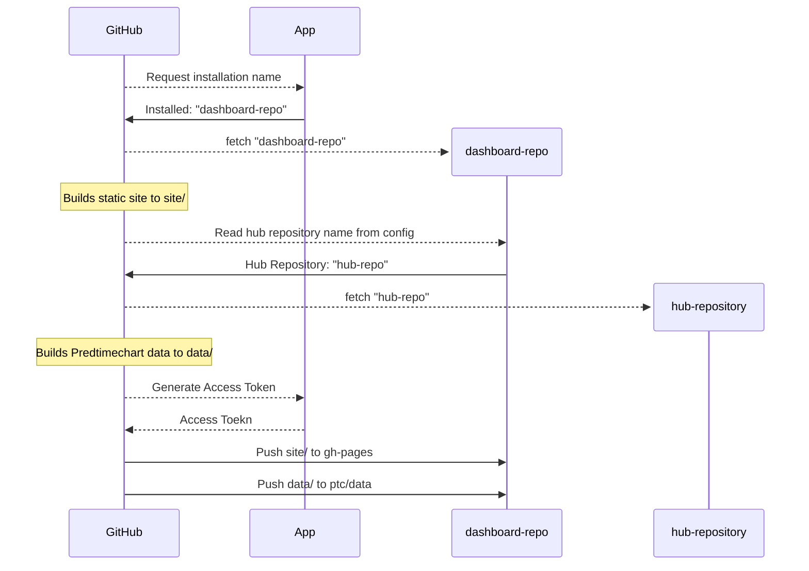
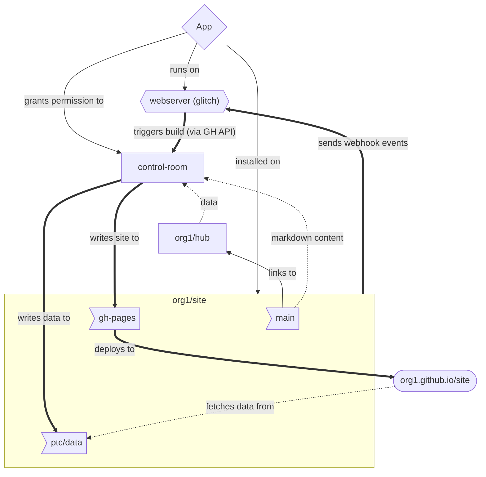

Welcome to Probot on Glitch
=========================

This is the Glitch equivalent of running `create-probot-app` to generate a new probot app locally. Updates to your code will instantly deploy and update live.

To get your own Glitch-hosted Probot up-and-running, follow these steps. If you need more detail, the [Probot Docs](https://probot.github.io/docs/development/#configuring-a-github-app) are a great place to go to learn more.

## Get Started with Probot on Glitch
1. When you [Remix](https://glitch.com/help/remix/) an app on Glitch you get your own **🤖Glitch Probot App**. 
2. The next step is to create a **😸GitHub App**. Probot now has a handy button that does this for you automatically! Click the **Glitch 🕶 Show** button. In the [editor](https://glitch.com/edit) it's right up top to the left. 
3. It will take you to your **🐠Glitch app URL** + `/probot`. And you'll see a button that says "Register GitHub App." Click it and it will take you to **GitHub** where you'll create a unique name for your **😸GitHub App** like "Worlds Coolest Probot"
4. It will guide you through the steps, you'll want to install your new **😸GitHub App** to at least one repository if you want to try it out. 
5. Open a new issue in the repository where you installed your app, and watch for your **🤖Glitch Probot App** to reply!

That's it! Head back to the Probot [Webhook Docs](https://probot.github.io/docs/webhooks/) to learn how to start building out your **🤖Glitch Probot App**. 

## Glossary 
- **🤖Glitch Probot App**: Your Probot, hosted on Glitch
- **🐠Glitch app URL**: the URL of your Glitch Probot app
- **😸GitHub App**: A GitHub App that your **🤖Glitch Probot App** uses to commicate with GitHub.
      
#### About Glitch

**Glitch** is the friendly commmunity where you'll build the app of your dreams. Glitch lets you instantly create, remix, edit, and host an app, bot or site, and you can invite collaborators or helpers to simultaneously edit code with you.

Find out more [about Glitch](https://glitch.com/about).
\ ゜o゜)ノ

This folder contains node JS scripts for the [hubDashboard App](https://github.com/apps/hubDashboard).
For repositories that have the app installed, these scripts will send a signal
to the control room workflows on specific events listed in `app.yml`.

## Broad Architecture

The hubDashboard App allows hub administrators to opt-in to an auto-generated
dashboard. By default, when anyone installs the app on their dashboard
repository, the dashboard will be built once on the initial build and then
every day on a schedule defined in this repository. The role of the app in this
workflow is twofold:

1. provide a list of repositories that have it installed.
2. provide credentials for our workflows to write to branches of the dashboard

The workflow looks like this for each repository 
(note the build processes are in parallel):

### On-Demand Builds

One of the advantages of using an app is that it can provide on-demand builds
without requiring maintainers running or knowing how to run GitHub workflows.

It's useful to understand that a GitHub App is kind of like a mailbox. It can
receive messages (webhooks) and send messages (API requests). Just like a
mailbox, you cannot just stick one in a random place an assume that you can
start receiving messages---you have to give it an address (a webserver).

In our case, we have [hubDashboard (GitHub app)](https://github.com/apps/hubDashboard) which is running on [glitch (webserver)](https://glitch.com/~crystal-glimmer-path). The scripts for this app live in [`app/index.js`](app/index.js).

When the app is installed on a repository, GitHub knows that it has to send
[webhook events related to installations, issue comments, and pushes](https://docs.github.com/en/webhooks/webhook-events-and-payloads) to the
webserver address (which at the moment is
https://crystal-glimmer-path.glitch.me/probot). When the app receives webhooks
that it recognises, then it will send a GitHub API request with a [repository
dispatch event](https://docs.github.com/en/actions/writing-workflows/choosing-when-your-workflow-runs/events-that-trigger-workflows#repository_dispatch)
which will trigger a build.

All the pieces together look like this:

